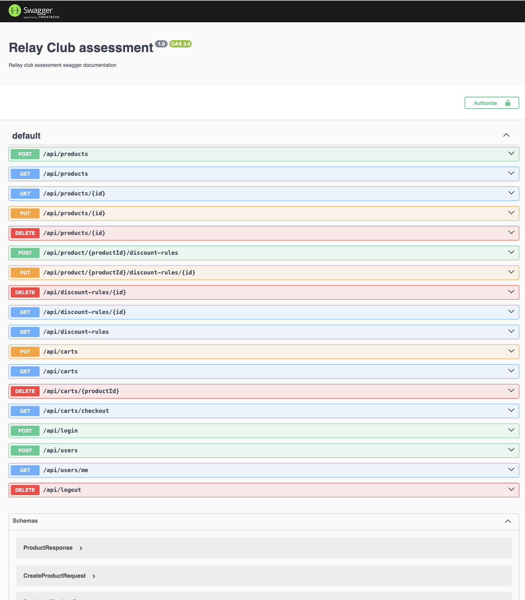
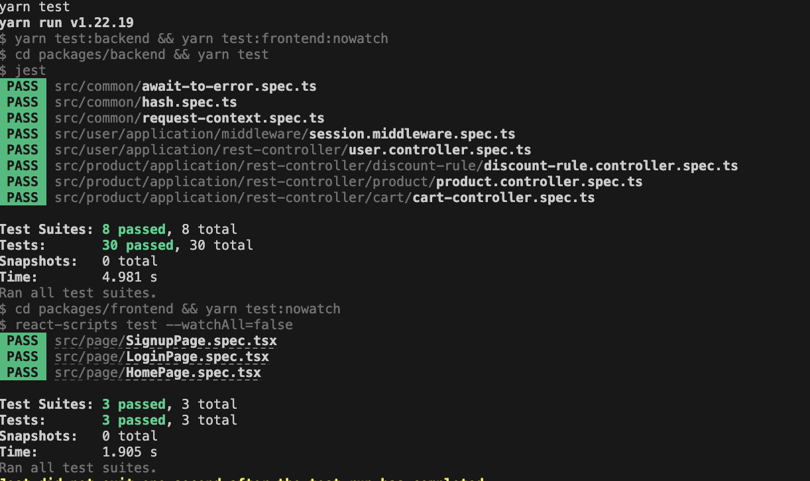
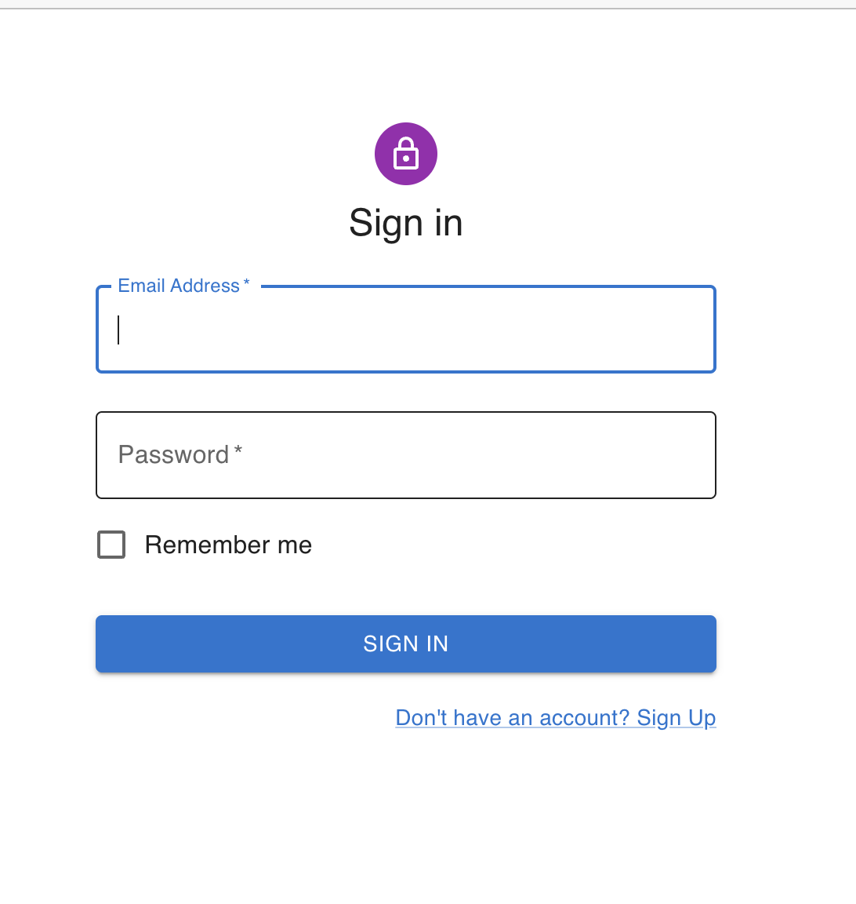
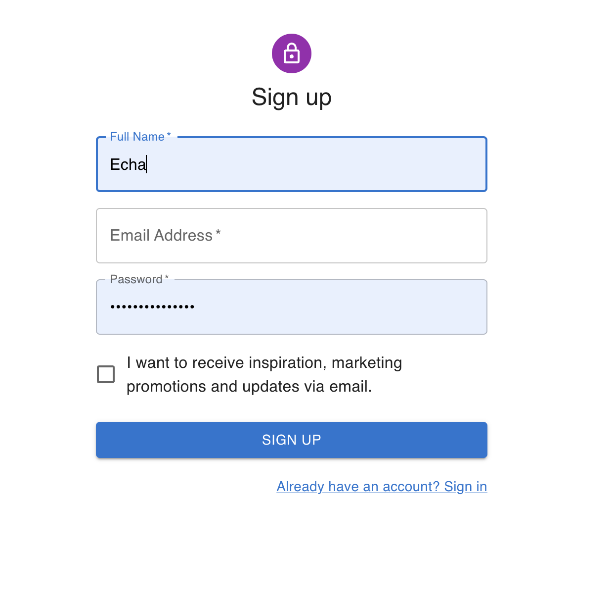
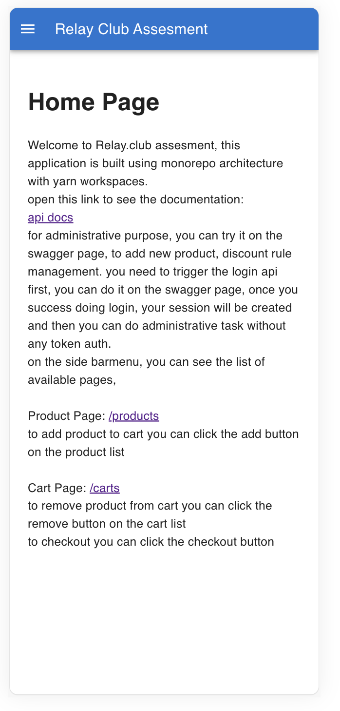
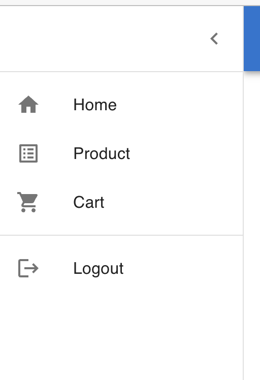
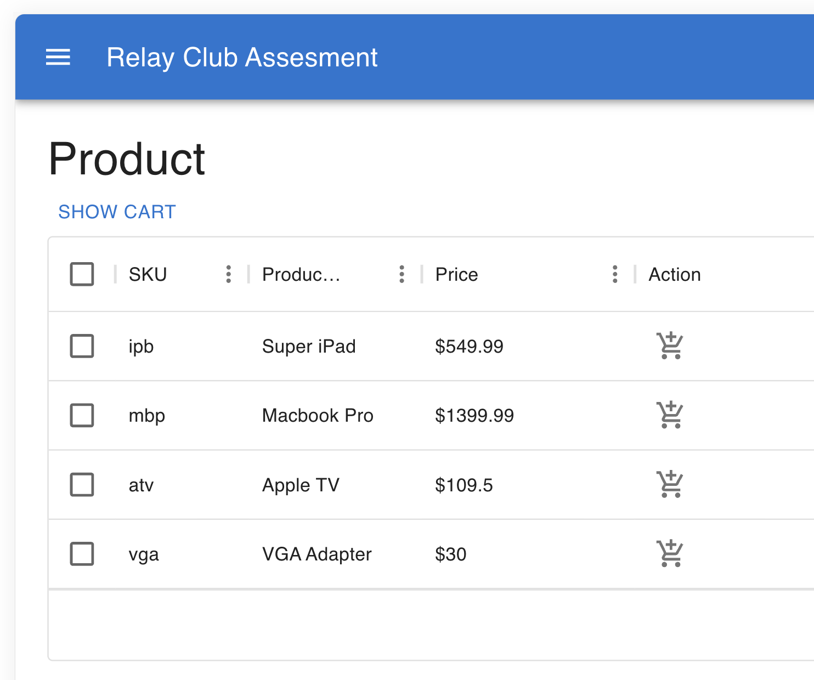
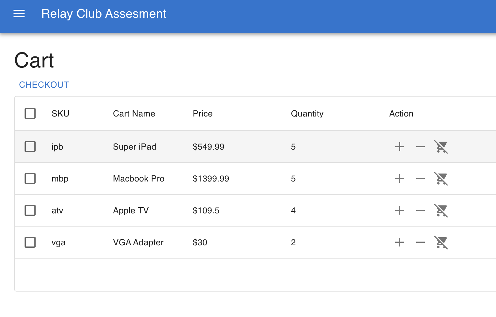
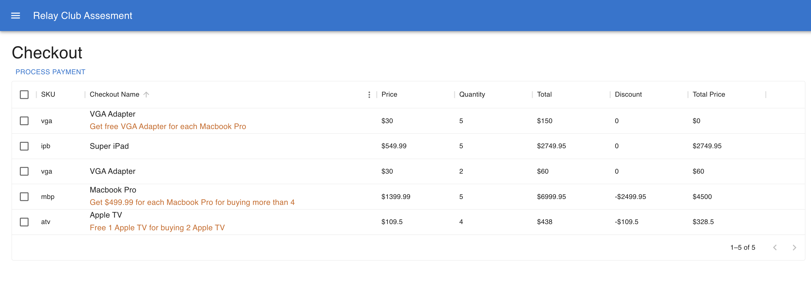

# backend-task

This project uses nestjs + react,

## Running Mysql Database
You can run the mysql using docker compose, you need to install docker compose first
```shell script
yarn docker-compose up -d
```

## Running the application in dev mode

You can run your application in dev mode that enables live coding using:
```shell script
yarn start:all
```
you can open the website on: `http://localhost:3000` and the backend on: `https://localhost:3001`

## Swagger UI
You can open swagger on this url `http://localhost:3001/docs`

for administrative purpose, you can try it on the swagger page, to add new
product, discount rule management. you need to trigger the login api
first, you can do it on the swagger page, once you success doing login,
your session will be created and then you can do administrative task
without any token auth.



## Packaging and running the application
This project will pack the nodejs bundle as executable files bin file for unix platform and `.exe` for windows platform, 
to run packaging follow this steps
### build nestjs project
```shell script
yarn build:backend
```
### build react project
```shell script
yarn build:frontend
```
### copy bundled react asset to nestjs bundle 
```shell script
yarn copy:frontend
```
### compile js files executable file using pkg
```shell script
yarn compile
```
## simple command
All of steps above can be done by this single yarn script
```shell script
yarn bundle
```
## Running application from executable file
make sure you have setup environment variable on your env, .env from `build/docker` will not applied on executable file
### using terminal
```shell script
bin/assesment-relay-club
```
### using executable file (on windows)
Double click on the `bin/assesment-relay-club.exe`

The application will runs on http://localhost:3001 (web + BE)

## generate docker image
You can store the bundled executable file inside docker image and run it wherever you want docker / kubernetes / openshift
```shell script
yarn docker:build
```

# Test
Running test
```shell script
yarn test
```
you will see the test running


# Screenshoot








# Environment Variable
```sh
MYSQL_HOST=localhost # mysql listen host, optional, default: localhost
MYSQL_PORT="3306" # mysql listen port, optional, default: 3306
MYSQL_DATABASE=locals # mysql database name
MYSQL_USER=locals # mysql username auth
MYSQL_PASSWORD=locals # mysql password auth
```